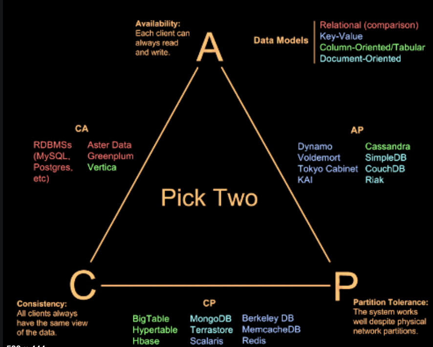

# General Notes

## Glossary
1. Since Kafka is a Messaging/Data Platform - `ACID capabilities` need to be planned during the Design.
2. Since Kafka is a Distributed System (for Scaling and Parallelism) - `CAP capabilities` need to be planned during the Design.
3. In the simplest form - You create Kafka Producer and Kafka Consumer Applications that transact via Kafka Broker in the form of Messages.
4. Kafka Broker - Kafka Server Instance that sits in between Producer and Consumer.
5. Kafka Cluster - A bunch of Kafka Brokers.
6. Producer sends data to a Kafka Topic Partition residing on a Kafka Broker managed by the Kafka Cluster Manager and Consumer reads from a Kafka Topic Partition.
7. Topic represents a Kafka Data Stream ex: Online-Orders-Stream, App1-Log-Stream, App2-Metric-Stream
8. Topic Partitions - For Parallelism and/or Scalability i.e Scaling beyond the limits of one Broker Instance.
9. Producer to Topic:
-   Many Producers to one Topic - Many POS Producers sending data to one Orders-Topic.
-   One Producer to Many Topics - POS Producer sending to Orders-Processor-Topic (optimised for Durable/Reliable writes ex: Set **acks to all**), Orders-Analytics-Topic (Optimised for Faster writes ex: Set **acks to 0**) 
10. Consumer to Topic Partition:
- One-To-One - One Consumers to read from one Topic Partition
11. Sequence Id/Offset of a Message:
- Messages arriving in a Topic Partition are given Sequence Id/Offset. 
- Sequence Id/ Offset of a Message is immutable - Once assigned the Offset cannot be changed.
- Sequence Id/ Offset of a Message is assigned to it as they arrive.
- Sequence Id is local to a Topic Partition i.e On Orders-Topic - Partition 1 and Partion 2 may both have a message with Sequence Id X.
- To locate a unique message we need - `Topic Name + Topic Partition # + Seq Id/Offset of the Message`.
12. Scaling: Multiple Producers, Multiple Topic Partitions + Consumer Group.
- Number of Consumers in a group <= Number of Partitions on the said Topic.
- Only one Consumer is allowed to read from a Topic partition at a time.
## HA and FT:
Kafka is designed with failure in mind - Kafka is designed with failure in mind. At some point in time, web communications or storage resources fail. Kafka is Distributed System so all the Distributed Systems Problems are relevant to Kafka too - ex: Consistency, Availability, Partition Tolerance.

**Leaders are special, in that producers and consumers can only interact with leaders in a Kafka cluster.**



### Preferred Leader Election
When a broker goes offline, one of the replicas becomes the new leader for the **topic partition**. When the broker comes back online, it has **no leader partitions**.

Kafka keeps track of which machine is configured to be the leader. Once the original broker is back up and in a good state, Kafka restores the information it missed in the interim and makes it the partition leader once more.

### Unclean Leader Election
Enable unclean leader election to allow an out-of-sync replica to become the leader and preserve the availability of the partition. With unclean leader election, messages that were not synced to the new leader are lost. This provides balance between **consistency (guaranteed message delivery) and availability** (see CAP theorem). With unclean leader election disabled, `if a broker containing the leader replica for a partition becomes unavailable`, and no in-sync replica exists to replace it, the partition becomes unavailable until the leader replica or another in-sync replica is back online.


## Writes -  Acks, Consistency and Availability
When writing or configuring a Kafka producer, you can choose how many replicas commit a new message before the message is acknowledged using the acks property.

Set **acks to 0** (immediately acknowledge the message without waiting for any brokers to commit), **1** (acknowledge after the leader commits the message), or **all** (acknowledge after all in-sync replicas are committed) according to your requirements. **Setting acks to all provides the highest consistency guarantee at the expense of slower writes to the cluster.**

### Minimum Insync Replicas
You can set the minimum number of in-sync replicas (ISRs) that must be available for the producer to successfully send messages to a partition using the min.insync.replicas setting. If min.insync.replicas is set to 2 and acks is set to all, each message must be written successfully to at least two replicas. This guarantees that the message is not lost **unless** both hosts crash. 

It also means that if one of the hosts crashes, the partition is **no longer available for writes**. Similar to the unclean leader election configuration, setting min.insync.replicas is a balance between higher consistency (requiring writes to more than one broker) and higher availability (allowing writes when fewer brokers are available).

```
min.insync.replicas.per.topic - To set this per Topic
min.insync.replicas.per.topic - To set this at Cluster level
```

## Kafka Deployment Design Considerations

1. Retention: 
```
Both Time and Space based Retention.
Have a way to update Retention on the fly.
Ensure that you dont Retain more than what is needed as this will reduce the Complexity by a huge factor.
```

2. Replication: 
```
Have Sufficient replication for Topic Partitions.
The default replication factor for new topics is one in ex: Cloudera's Kafka Distribution. Whereas, In AWS MSK the default replication factor is set to 3. 
For high availability production systems, The recommended replication factor should be at least three. This requires at least three Kafka brokers.
```

3. Consumer Lag
```
Ensure Consumer Lag to be within reasonable limits.
Ensure that the Retention is sufficient to handle Consumer Lag.
```

4. Cluster Infra Design
```
Ensure that the Cluster is balanced 
ex: A single Broker does not end-up being a leader for dis-proportionate number of Topic Partitions.
Ensure that the Cluster Nodes are spread across Failure Domains be it - Physical Hosts, Racks, AZs etc....
Ensure that the Storage design interms of Size, IOPs etc are all well planned.
```
